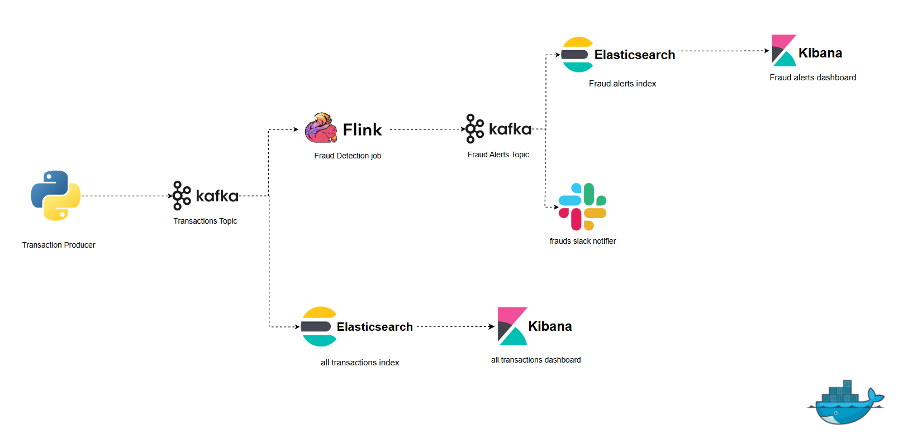
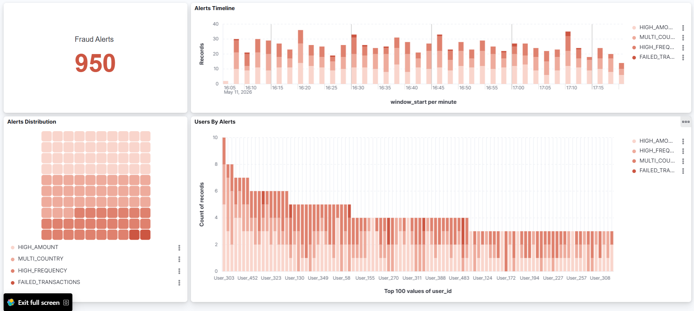
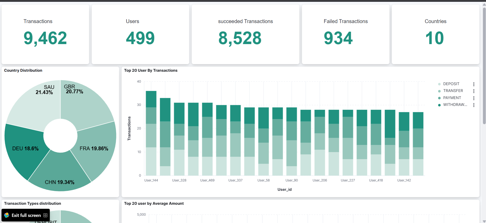
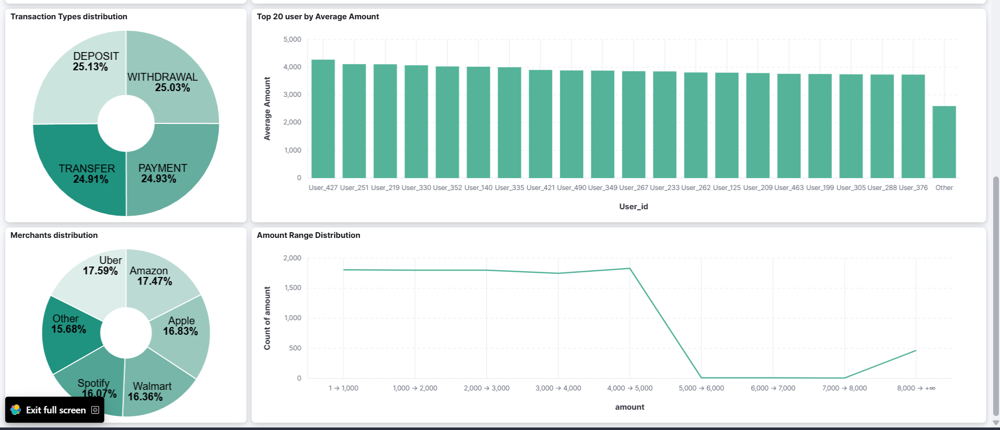
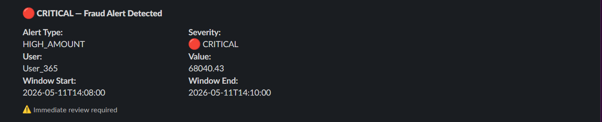

# Real-Time Transaction Fraud Detection Pipeline

A real-time fraud detection system that ingests financial transactions, detects fraudulent patterns using stream processing, stores results in Elasticsearch, visualizes them in Kibana, and sends critical alerts to Slack.

---

## Architecture



---

## Tech Stack

| Component | Technology | Role |
|---|---|---|
| Message Broker | Apache Kafka (KRaft) | Decouples producers from consumers, buffers events |
| Stream Processing | Apache Flink — PyFlink Table API | Windowed fraud detection over event streams |
| Storage & Search | Elasticsearch 8.12 | Stores alerts and raw transactions for querying |
| Visualization | Kibana 8.12 | Real-time dashboards on top of Elasticsearch |
| Notifications | Slack Webhooks | Critical alert delivery to a Slack channel |
| Containerization | Docker Compose | Runs all infrastructure services locally |

---

## Project Structure

```
Transactions_Fraud_Detection/
├── docker-compose.yml
├── .env                              # SLACK_WEBHOOK_URL (not committed)
├── producer/
│   └── transaction_producer.py       # Generates and sends transactions to Kafka
├── flink/
│   ├── Dockerfile                    # Custom Flink image with PyFlink + Kafka JARs
│   └── jobs/
│       ├── fraud_detection_job.py    # Main fraud detection Flink job
│       ├── test_datastream_api.py    # DataStream API prototype
│       └── test_table_api.py         # Table API prototype
├── elasticsearch/
│   ├── fraud_alerts_indexer.py       # Indexes fraud alerts into Elasticsearch
│   └── transactions_indexer.py       # Indexes raw transactions into Elasticsearch
├── slack/
│   └── slack_notifier.py             # Sends critical fraud alerts to Slack
└── images/                           # Dashboard and architecture screenshots
```

---

## Data Flow

The pipeline is split into five sequential stages. Each stage is decoupled from the next through Kafka, meaning any component can be stopped, restarted, or scaled independently without affecting the others.

```
┌─────────────────────────────────────────────────────────────────┐
│  Stage 1: Transaction Generation                                │
│  transaction_producer.py → Kafka (transactions topic)          │
└───────────────────────────────┬─────────────────────────────────┘
                                │
              ┌─────────────────┴──────────────────┐
              │                                    │
┌─────────────▼──────────────┐    ┌───────────────▼──────────────┐
│  Stage 2: Stream Processing│    │  Stage 2b: Raw Storage       │
│  Flink (fraud_detection    │    │  transactions_indexer.py     │
│  _job.py)                  │    │  → ES (transactions_raw)     │
└─────────────┬──────────────┘    └──────────────────────────────┘
              │
              │ Kafka (fraud_alerts topic)
              │
┌─────────────┴──────────────────────────────────────────────────┐
│  Stage 3: Alert Distribution                                   │
│           ↓                          ↓                         │
│  fraud_alerts_indexer.py     slack_notifier.py                 │
│  → ES (fraud_alerts)         → Slack (critical only)           │
└────────────────────────────────────────────────────────────────┘
              │
┌─────────────▼──────────────┐
│  Stage 4: Visualization    │
│  Kibana Dashboards         │
└────────────────────────────┘
```

---

### Stage 1 — Transaction Generation

`transaction_producer.py` continuously generates synthetic financial transactions and publishes them to the `transactions` Kafka topic every 0.5 seconds.

**Transaction structure:**
```json
{
  "transaction_id": "c46bd0bd-f080-44d3-9e0c-fa170a58345d",
  "user_id": "User_142",
  "timestamp": "2026-05-09T14:12:33.412876+00:00",
  "transaction_type": "PAYMENT",
  "amount": 3412.55,
  "country": "EGY",
  "currency": "EGP",
  "merchant": "Amazon",
  "ip_address": "192.168.45.12",
  "status": "SUCCESS"
}
```

**Simulation rules:**
- 500 users, each assigned a fixed home country at startup
- 90% of transactions come from the user's home country, 10% from a random country — simulating travel or multi-country fraud
- 95% of amounts are $1–$5,000 (normal), 5% are $5,001–$80,000 (large)
- 90% of transactions succeed, 10% fail
- Transaction key is `user_id` so all transactions from the same user go to the same Kafka partition, preserving order per user

---

### Stage 2 — Kafka: The Event Backbone

Kafka sits between every stage of the pipeline. It acts as a durable, ordered log of events that any number of consumers can read independently at their own pace.

#### Topics

| Topic | Producer | Consumers | Partitions | Purpose |
|---|---|---|---|---|
| `transactions` | `transaction_producer.py` | Flink job, `transactions_indexer.py` | 1 | Carries every raw financial transaction |
| `fraud_alerts` | Flink fraud detection job | `fraud_alerts_indexer.py`, `slack_notifier.py` | 1 | Carries detected fraud alerts after each window closes |

**`transactions`**

Receives every raw transaction from the producer. Two independent consumer groups read from this topic:
- Flink reads it for fraud detection
- `transactions_indexer.py` reads it to store every transaction in Elasticsearch

Because each consumer has its own offset, they never interfere. Flink can be slow or stopped without the transactions indexer being affected.

**`fraud_alerts`**

Receives fraud alerts emitted by Flink after each window closes. Two independent consumer groups read from this topic:
- `fraud_alerts_indexer.py` indexes every alert into Elasticsearch
- `slack_notifier.py` filters and forwards critical alerts to Slack

#### Consumer Groups

A consumer group is Kafka's mechanism for tracking how far a consumer has read. Each group has its own committed offset per topic partition — the position of the last message it successfully processed.

| Group ID | Topic | Startup Mode | Resume Behavior |
|---|---|---|---|
| `flink_consumer` | transactions | `latest-offset` | Resumes from last checkpoint |
| `transactions_raw_consumer` | transactions | `earliest` | Replays from beginning if no offset |
| `fraud_alerts_consumer` | fraud_alerts | `latest` | Resumes from last committed offset |
| `slack_consumer` | fraud_alerts | `latest` | Resumes from last committed offset |

**`latest-offset` vs `earliest`:**
- `latest` — start from new messages only, skip everything already in the topic
- `earliest` — replay everything from the very beginning if no committed offset exists

The transactions indexer uses `earliest` so it never misses historical transactions. The fraud alert consumers use `latest` so restarting them does not flood Slack or create duplicate ES documents from past alerts.

**Checking consumer group health:**
```bash
docker exec -it kafka kafka-consumer-groups --bootstrap-server localhost:9092 \
    --describe --group flink_consumer
```

Output shows `CURRENT-OFFSET`, `LOG-END-OFFSET`, and `LAG`. LAG = 0 means the consumer is fully caught up. A growing lag means the consumer is falling behind the producer.

---

### Stage 3 — Stream Processing (Apache Flink)

The Flink job reads from the `transactions` topic using the PyFlink Table API with SQL. It uses **event time** — the `timestamp` field inside each transaction — rather than the wall clock time when Flink processes it. This ensures windows are always based on when transactions actually happened, not when they arrived at Flink.

#### Watermarks

A watermark tells Flink how far behind real time it should expect late-arriving events. The job uses:
```sql
WATERMARK FOR event_time AS event_time - INTERVAL '20' SECOND
```
This means Flink waits up to 20 seconds for late events before closing a window. Events arriving more than 20 seconds late are dropped.

#### Tumbling Windows

All four fraud rules use **2-minute tumbling windows** — fixed non-overlapping time slices:

```
12:00:00 ──────────────── 12:02:00 ──────────────── 12:04:00
│    Window 1 closes     │    Window 2 closes       │
│    → emit alerts       │    → emit alerts          │
```

Flink collects all transactions within each window, groups by `user_id`, applies the aggregation, evaluates the threshold, and emits an alert if the threshold is exceeded. The four streams are merged with `UNION ALL` and written to the `fraud_alerts` Kafka topic.

#### Fraud Detection Rules

| Alert Type | Aggregation | Threshold | Example |
|---|---|---|---|
| `HIGH_AMOUNT` | `SUM(amount)` per user | > $20,000 | User made $35,000 in transactions in 2 minutes |
| `HIGH_FREQUENCY` | `COUNT(*)` per user | ≥ 3 | User made 4 transactions in 2 minutes |
| `MULTI_COUNTRY` | `COUNT(DISTINCT country)` per user | > 1 | User transacted in EGY and USA in same window |
| `FAILED_TRANSACTIONS` | `COUNT(*)` where status=FAILED per user | ≥ 2 | User had 3 failed transactions in 2 minutes |

#### Checkpointing

Flink periodically saves its state (including Kafka offsets) to a checkpoint. On restart, it recovers from the last checkpoint so no events are lost. The checkpoint interval is set to 60 seconds:
```python
env.enable_checkpointing(60000)
```
A shorter interval (e.g. 10 seconds) causes Flink to re-emit window results at checkpoint boundaries, producing duplicates. 60 seconds gives each 2-minute window enough time to complete cleanly before the next checkpoint fires.

---

### Stage 4 — Alert Storage (Elasticsearch)

#### `fraud_alerts` index

`fraud_alerts_indexer.py` reads from the `fraud_alerts` Kafka topic and indexes each alert into Elasticsearch. To handle duplicates that Flink may emit at checkpoint boundaries, it uses a composite document ID:

```python
doc_id = f"{alert['user_id']}_{alert['window_start']}_{alert['alert_type']}"
es.index(index="fraud_alerts", id=doc_id, document=alert, op_type="create")
```

`op_type="create"` tells Elasticsearch to reject the write if a document with that ID already exists. This is atomic and race-condition safe — the second duplicate is silently rejected, keeping the index clean.

**Schema:**

| Field | Type | Description |
|---|---|---|
| `user_id` | keyword | User who triggered the alert |
| `alert_value` | double | Aggregated value — sum of amounts or count of events |
| `window_start` | date | Start of the 2-minute detection window (UTC) |
| `window_end` | date | End of the 2-minute detection window (UTC) |
| `alert_type` | keyword | HIGH_AMOUNT / HIGH_FREQUENCY / MULTI_COUNTRY / FAILED_TRANSACTIONS |
| `ingested_at` | date | When the alert was indexed into ES (UTC) |

#### `transactions_raw` index

`transactions_indexer.py` reads directly from the `transactions` Kafka topic and stores every raw transaction for historical analysis and Kibana dashboards. It uses `transaction_id` as the document ID to prevent duplicates.

**Schema:**

| Field | Type | Description |
|---|---|---|
| `transaction_id` | keyword | Unique UUID per transaction |
| `user_id` | keyword | User identifier |
| `timestamp` | date | When the transaction occurred (UTC) |
| `transaction_type` | keyword | PAYMENT / WITHDRAWAL / TRANSFER / DEPOSIT |
| `amount` | double | Transaction amount |
| `country` | keyword | Country where transaction occurred |
| `currency` | keyword | Currency code |
| `merchant` | keyword | Merchant name — PAYMENT transactions only |
| `ip_address` | keyword | Source IP address |
| `status` | keyword | SUCCESS or FAILED |
| `ingested_at` | date | When indexed into ES (UTC) |

---

### Stage 5 — Slack Notifications

`slack_notifier.py` reads from `fraud_alerts` using its own consumer group. Not every alert goes to Slack — only the most critical ones that need immediate human attention. Sending everything to Slack would be too noisy with 500 users generating alerts every 2 minutes.

**Filtering logic:**

| Alert Type | Slack Threshold | Severity | Reason not all sent |
|---|---|---|---|
| `HIGH_AMOUNT` | ≥ $50,000 | 🔴 CRITICAL | Amounts between $20K–$50K are suspicious but not critical |
| `MULTI_COUNTRY` | ≥ 3 countries | 🟠 HIGH | 2 countries could be legitimate travel |
| `HIGH_FREQUENCY` | Not sent | — | Too noisy with 500 users |
| `FAILED_TRANSACTIONS` | Not sent | — | Low threshold, high volume |

---

## Results

### Fraud Alerts Dashboard



Shows total alert count, alert timeline by type (`window_start`), percentage breakdown per alert type, and alerts per user. The timeline uses `window_start` rather than `ingested_at` so it reflects when fraud actually occurred, not when the system detected it.

---

### Transactions Dashboard





Shows total/succeeded/failed transaction counts, transaction type distribution, merchant breakdown, users by average amount, users by transaction count, and amount distribution histogram. The amount histogram clearly shows the 95/5 split between normal ($1–$5K) and large ($5K+) transactions.

---

### Slack Notifications



---

## Setup

### 1. Clone and configure

```bash
git clone <repo-url>
cd Transactions_Fraud_Detection
```

Create `.env`:
```
SLACK_WEBHOOK_URL=https://hooks.slack.com/services/YOUR/WEBHOOK/URL
```

### 2. Start infrastructure

```bash
docker-compose up -d
```

Verify all 5 containers are running:
```bash
docker-compose ps
```

### 3. Create Kafka topics

```bash
docker exec -it kafka kafka-topics.sh --bootstrap-server kafka:29092 \
    --create --topic transactions --partitions 1 --replication-factor 1

docker exec -it kafka kafka-topics.sh --bootstrap-server kafka:29092 \
    --create --topic fraud_alerts --partitions 1 --replication-factor 1
```

### 4. Install Python dependencies

```bash
pip install confluent-kafka elasticsearch==8.12.0 requests python-dotenv
```

### 5. Run the pipeline

```bash
# Terminal 1 — Flink fraud detection job
docker exec flink-jobmanager python /app/jobs/fraud_detection_job.py

# Terminal 2 — Transaction producer
python producer/transaction_producer.py

# Terminal 3 — Fraud alerts ES indexer
python elasticsearch/fraud_alerts_indexer.py

# Terminal 4 — Raw transactions ES indexer
python elasticsearch/transactions_indexer.py

# Terminal 5 — Slack notifier
python slack/slack_notifier.py
```

### 6. Access services

| Service | URL |
|---|---|
| Kibana | http://localhost:5601 |
| Flink UI | http://localhost:8081 |
| Elasticsearch | http://localhost:9200 |

---

## Monitoring

**Check consumer group lag:**
```bash
# Is Flink keeping up with the producer?
docker exec -it kafka kafka-consumer-groups --bootstrap-server localhost:9092 \
    --describe --group flink_consumer

# Are alerts being indexed?
docker exec -it kafka kafka-consumer-groups --bootstrap-server localhost:9092 \
    --describe --group fraud_alerts_consumer
```

**Check document counts:**
```bash
curl http://localhost:9200/fraud_alerts/_count
curl http://localhost:9200/transactions_raw/_count
```

**Compare Kafka vs ES counts to verify deduplication:**
```bash
# If ES count < Kafka fraud_alerts offset → deduplication is working
docker exec -it kafka kafka-consumer-groups --bootstrap-server localhost:9092 \
    --describe --group fraud_alerts_consumer
curl http://localhost:9200/fraud_alerts/_count
```

---

## Key Design Decisions

**PyFlink Table API over DataStream API** — SQL-based windowed aggregations are cleaner and require no custom Python classes for windowing, reducing, or filtering. Watermarks, windowing, grouping, and HAVING clauses are all expressed in standard SQL.

**Separate ES and Slack consumers** — each has its own Kafka consumer group so a Slack API outage never affects Elasticsearch indexing. Both receive every alert independently and can be restarted, scaled, or updated without touching each other.

**Composite document ID deduplication** — Flink's at-least-once delivery guarantee means duplicates can appear in Kafka. Using `user_id + window_start + alert_type` as the Elasticsearch document ID with `op_type="create"` atomically rejects any duplicate regardless of timing or race conditions.

**60-second checkpointing** — shorter checkpoint intervals (10 seconds) caused Flink to re-emit window results at checkpoint boundaries, producing duplicates in Kafka. 60 seconds gives each 2-minute window enough time to complete and commit cleanly.

**Event time over processing time** — basing windows on the transaction's actual `timestamp` ensures correctness when Flink restarts and reprocesses events. Processing time would assign events to wrong windows after a restart.

**UTC everywhere** — all timestamps (producer, Flink window times, ES ingested_at) are stored in UTC. Without this, timezone differences between the producer machine and the Docker containers created apparent paradoxes where `ingested_at` appeared earlier than `window_start`.

**User home country simulation** — each of the 500 users has a fixed home country assigned at producer startup. 90% of their transactions come from that country. This makes MULTI_COUNTRY alerts meaningful — a user transacting from two countries in the same 2-minute window is genuinely suspicious rather than just random noise.